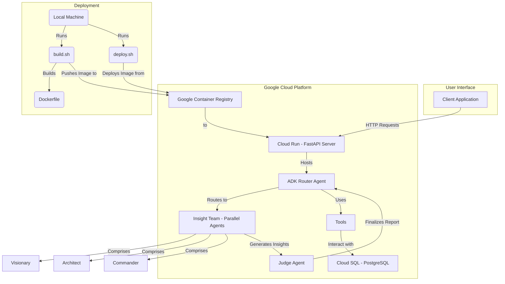

# AI-enabled Life Tracker (FastAPI Service + ADK)

## Motivation

For me, the process of tracking daily life always felt like a chore, it imposed a kind of "mental penalty" that slowed me down. The context switch between analytical thinking and creative living is real, and traditional tools (think physical notebooks or spreadsheets) often add more friction than they remove. You end up wrestling with rigid formats and questioning if the effort will ever pay off in a format you can actually reuse long-term.

This project started as a personal quest to eliminate that friction. The vision was to build a system that feels less like a database (although it's built on top of one) and more like a trusted conversational partner that you can talk to, dump random thoughts into, and rely on to make sense of the chaos.

Due to the complexity of the Agent Development Kit (ADK), I first started experimenting with a simple Python GenAI SDK application that used Gemini's function calling. I managed to transform raw, unstructured audio or text into structured, actionable data within local CSV or JSON files. Voice notes became useful data without me lifting a finger. But the goal was never just data collection. It's about creating a powerful feedback loop for self-improvement. The system analyzes my patterns to provide personalized, "tough love" advice, uncovering correlations I'd never see on my own. It's the AI coach that slaps me with the cold, hard data, showing me that sleep is my main productivity driver or that exercise is the catalyst for a better mood.

This is about building a relentless personal AI coach that helps me understand where my time truly goes and gives me the brutally honest feedback needed to conquer my goals.

## The Journey to ADK: A Project's Evolution

This project's architecture is the result of a deliberate, phased evolution. Each stage was a direct response to the limitations of the previous one, a journey from a simple prototype to a sophisticated intelligence engine.

1.  **Phase 1: The Genesis (Python GenAI SDK)**
    The project began as a [simple multimodal chat app](https://www.youtube.com/watch?v=_r5uisRJAmQ) using the Python `genai` SDK. The initial goal was simple: capture thoughts via both audio and text to prove the core concept of a low-friction, conversational logging system.

2.  **Phase 2: Adding Intelligence (Function Calling)**
    The next leap was integrating [**Function Calling**](https://www.youtube.com/watch?v=qY_42glVgOc). This transformed the application from a simple chatbot into a structured data-entry tool. The AI could now interpret intent, turning a spoken phrase like "I need to finish the hackathon video" into a concrete task stored in a local JSON or CSV file. This was the first step toward making the data truly actionable.

3.  **Phase 3: Building a Scalable Foundation (Cloud SQL)**
    While local CSV & JSON files were fine for a prototype, they lacked the robustness for a true life-logging application. I re-architected the backend, and replaced the files with a [**Cloud SQL for PostgreSQL** database](https://www.youtube.com/watch?v=y8XC-dz7_dk). This wasn't just a technical upgrade, it was about creating a secure, scalable, and relational foundation for long-term data storage and complex analysis.

4.  **Phase 4: The Leap to Sophistication (Google Agent Development Kit)**
    With a solid data backend, the final challenge was elevating the intelligence layer. A single agent is powerful, but orchestrating complex reasoning requires a more advanced framework. The **Agent Development Kit (ADK)** was the logical next step. My vision was to build a personal intelligence unit, similar to how a president has a chief of staff and an army of analysts constantly monitoring, analyzing, and refining intelligence to manage daily operations. The ADK allows me to build exactly that: a team of specialized AI assistants working for me 24/7, debating strategies, and drafting plans. The "Judge" agent acts as my chief of staff, synthesizing the findings from my "analyst" team to deliver clear, actionable insights.

## Hackathon Focus: Automation & Insights

This project directly addresses two key hackathon categories:

-   **Automation of Complex Processes:** It automates the tedious, manual process of life-logging. By interpreting unstructured natural language, the system automatically structures data, creates tasks, updates user context, and logs everything in a database, transforming a high-friction manual task into a seamless workflow.
-   **Data Analysis and Insights:** The core purpose of the Insight Engine is to autonomously analyze a user's accumulated data. The multi-agent "Insight Team" is designed to derive meaningful insights from disparate data points, identify behavioral patterns, and present its findings collaboratively, acting as a 24/7 available personal intelligence team.

## Features

-   **Multi-Agent Architecture:** The system uses a `Router Agent` to direct user requests to a team of specialized agents, including a `Visionary`, `Architect`, `Commander`, and `Judge`, to generate comprehensive insights.
-   **FastAPI Integration:** The ADK agent is exposed as a web service using FastAPI, allowing for easy integration with other services and user interfaces.
-   **Cloud-Native Architecture:** The application is designed for deployment on Google Cloud, using **Cloud Run** for scalable, serverless application hosting and **Cloud SQL for PostgreSQL** for robust, persistent data storage.
-   **Intelligent Tool Use:** The agent can use a variety of tools to interact with the database, including adding log entries, managing tasks, and updating user background information.
-   **Comprehensive Data Management:**
    *   **Input Log:** A complete history of user inputs.
    *   **Task Management:** A system for creating, updating, and listing tasks.
    -   **Background Info:** A JSON-based view for providing and updating personal context to tailor AI responses.
-   **Observability:** The application is instrumented with OpenTelemetry for tracing and logging to Google Cloud Logging.

## Architecture Diagram



## Prerequisites

-   **Google Cloud Project:** A GCP project with the necessary APIs enabled.
-   **Google GenAI API Key:** Obtain a an API key from [Google AI Studio](https://aistudio.google.com/apikey).
-   **Python 3.12:** Ensure you have Python 3.12 installed on your system.
-   **Poetry:** Poetry installed for dependency management.
-   **Docker:** Docker installed and running locally to build the container image.
-   **gcloud CLI:** The Google Cloud CLI installed and authenticated.

## Installation & Deployment

1.  **Clone the repository:**
    ```bash
    git clone <repository-url>
    cd gemini_adk_lifetracker_demo
    ```

2.  **Install dependencies:**
    ```bash
    poetry install
    ```

3.  **Set up Environment File:**
    -   Copy `.env.example` to `.env`.
    -   Fill in all the required values for your GCP project and other credentials.

4.  **Build and Push the Docker Image:**
    -   The `build.sh` script builds the Docker image and pushes it to your project's Google Container Registry.
    -   **For Production:**
        ```bash
        ./build.sh
        ```

5.  **Deploy to Cloud Run:**
    -   The `deploy.sh` script deploys the container image from GCR to Cloud Run, configuring all necessary environment variables from the `.env` file.
    -   **For Production:**
        ```bash
        ./deploy.sh
        ```
    -   The script will output the URL of your deployed service.


## Code Overview

-   **`server.py`:** The main FastAPI application. Handles API endpoints, middleware, and application lifecycle events.
-   **`gemini_adk_demo/agent.py`:** Defines the multi-agent architecture, including the `Router Agent` and the `Insight Team`.
-   **`gemini_adk_demo/prompt.py`:** Contains the prompts used by the agents.
-   **`gemini_adk_demo/tools/`:** Contains the tools used by the agents.
-   **`gemini_adk_demo/shared_libraries/`:** Contains shared utilities, including database interaction logic.
    -   **`crud.py`:** Contains the database CRUD operations.
    -   **`database.py`:** Configures the database connection.
    -   **`models.py`:** Defines the database schema using SQLAlchemy ORM.
    -   **`schemas.py`:** Defines the Pydantic schemas for data validation.
    -   **`constants.py`:** Contains constants used throughout the application.
    -   **`tracing.py`:** Contains the OpenTelemetry trace exporter.
-   **`eval/`:** Contains scripts for evaluating the agent.
    -   **`conversation.py`:** A script to interact with the agent through the command line.

## LLM Interaction and Tool Use

The intelligence of this application lies in how the Gemini model interprets user input and interacts with the application's backend through a sophisticated tool-use mechanism.

### System Prompt & Context

On every interaction, the LLM is provided with a detailed system prompt that includes:
-   **Current Time and Date:** To provide timely and relevant responses.
-   **User's Background Information:** A JSON object of the user's goals, values, and preferences.
-   **Recent Log Entries:** A summary of the user's recent log entries to understand recent context.
-   **Current Tasks:** A list of all open and in-progress tasks.
-   **Tool Definitions:** A schema of all available tools the model can use.

This rich context allows the model to make informed decisions rather than just responding to the immediate user prompt.

### Available Tools

The model has access to a set of tools that it can call to perform actions within the application. The decision to call one or more tools is made by the LLM based on the user's intent.

1.  **`add_log_entry`**:
    -   **Purpose:** To record a user's thoughts, observations, or general statements.
    -   **Trigger:** Called whenever the user provides a statement that should be logged for future reference.

2.  **`update_background_info`**:
    -   **Purpose:** To update the user's core profile, including their goals, values, challenges, and habits.
    -   **Trigger:** Called when the user explicitly states a new goal, a change in values, or provides any new personal context.

3.  **`create_tasks`**, **`update_tasks`**, **`list_tasks`**:
    -   **Purpose:** A comprehensive set of tools to add, update, or list tasks.
    -   **Triggers:**
        -   `create_tasks`: When the user expresses a concrete, actionable intent.
        -   `update_tasks`: When the user indicates progress or completion of a task.
        -   `list_tasks`: When the user asks to see their current tasks.

This intelligent, multi-faceted approach allows the application to act as a true assistant, seamlessly integrating user conversation into structured, actionable data.

## Evaluation

To evaluate the agent's performance, you can use the `conversation.py` script located in the `eval/` directory. This script allows you to interact with the agent through the command line and observe its responses and tool calls in real-time.

**Note:** The application must be deployed and running on Cloud Run for the evaluation script to work.

**In a separate terminal, run the conversation script:**
```bash
python eval/conversation.py
```

## Limitations

-   This is a demo and may not handle all edge cases or complex conversation scenarios.
-   Error handling is minimal.
-   The LLM's ability to perfectly categorize logs or structure background information from free text is dependent on the model's capabilities and the clarity of user input.

## Future Enhancements

-   Improve error handling and robustness.
-   Implement more sophisticated conversation management.
-   Expand function calling capabilities with more tools.
-   Integrate user authentication and a consent layer.
-   Embed the agent in a Streamlit frontend with more extensive CRUD functionality, similar to the `gemini_multimodal_demo` project.

## Contributing

Contributions are welcome! Please feel free to submit issues or pull requests.

## License
This project is licensed under the MIT License - see the `LICENSE` file for details.
